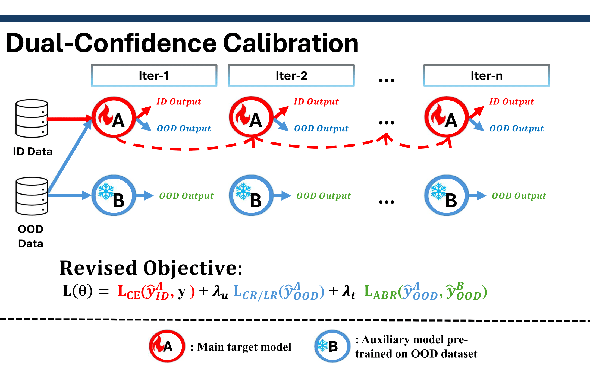

# 🛡️ Dual-Confidence Calibration: Defending Against Model Inversion via Auxiliary-Supervised OOD Regularization

<p align="center">
    <a href="https://github.com/AlvinYu025/FYP-Dual-Confidence-Calibration"></a>
    <a href=""></a>
</p>



[//]: # (*Figure: Our Dual Confidence Calibration framework simultaneously optimizes in-distribution confidence and OOD detection*)

## 📚 Table of Contents
1. [Environment Setup](#1-environment-setup)
2. [Dataset Preparation](#2-dataset-preparation)
3. [Model Training](#3-model-training)
4. [Attack Evaluation](#4-attack-evaluation)
5. [MSP Score Calculation](#5-msp-score-calculation)
6. [Acknowledgements](#6-acknowledgements)

---

## 1. 🛠️ Environment Setup

### Conda Environment Configuration
Create the project environment with one command:
```
conda env create -f DCC_environment.yml
```


> **Pro Tip** 💡: Use `conda activate DCC` to activate the environment before running any experiments

---

## 2. 📦 Dataset Preparation

### Supported Datasets
| Dataset | Purpose | Resolution | Official Link | 📥 Download |
|---------|---------|------------|---------------|-------------|
| **CelebA** | Target Model Training | 178×218 | [Project Page](https://mmlab.ie.cuhk.edu.hk/projects/CelebA.html) | [Dataset](http://mmlab.ie.cuhk.edu.hk/projects/CelebA.html) |
| **FaceScrub** | Auxiliary Training | Variable | [Website](https://vintage.winklerbros.net/facescrub.html) | [Download](https://github.com/faceteam/facescrub) |
| **FFHQ** | OOD Evaluation | 1024×1024 | [GitHub](https://github.com/NVlabs/ffhq-dataset) | [Torrent](https://github.com/NVlabs/ffhq-dataset) |

### Directory Structure
```bash
datasets/
├── celeba/
│   ├── img_align_celeba/
│   └── meta/
│       ├── trainset.txt
│       ├── testset.txt
│       ├── private.txt
│       ├── ood_trainset.txt
│       └── ood_test.txt
│
├── ffhq/
│   ├── thumbnails128x128/
│   └── meta/
│       └── ganset.txt
│
└── facescrub/
    ├── actors/
    ├── actresses/
    └── meta/
        ├── trainset.txt
        └── testset.txt
```
## 3. 🚀 Model Training

- Modify the configuration in `.\config\celeba\training_classifiers\celeba_classify.json`
- Then, run the following command line to get the target models with SOTA defense
  ```
  python train_{defense_method}.py
  ```
  or regular model:
  ```
  python train_reg.py
  ```
  
Then, place the paths of trained models in the `train_ft_model` in the `engine.py` and run:
  ```
  python train_dcc.py --lambda_oe=0.001 --lambda_aux=0.001 --method='CR' --defense='{defense_method}'
  ```
to start our DCC post-training.

## 4. 🔥 Attack Evaluation

* Modify the configuration in
  * `./config/celeba/attacking/celeba.json` if the prior knowledge is learned from CelebA
  * `./config/celeba/attacking/ffhq.json` if the prior knowledge is learned from FFHQ

* Important arguments:
  * `method`: select the method either ***gmi***, ***kedmi***, ***rlb*** and ***brep***
  * `variant` select the variant either ***baseline***, ***aug***, ***logit***, or ***lomma***

* Then, run the following command line to attack
    ```
    python recovery.py --configs='./config/celeba/attacking/celeba.json'


## 5. 📈 OOD Score Calculation

### Out-of-Distribution Detection Analysis
Calculate model confidence scores for OOD detection using multiple metrics:

```bash
python compute_ood_score.py \
    --defense='reg' \                       # Defense method type {reg|tl|ls|bido|vib}
    --path_T='path/to/trained_model.pth' \  # Path to target model
    --config='./config/celeba/training_classifiers/classify.json' \
    --mode='msp'                            # OOD evaluation metric {msp|energy}
    --save_dir='results'                    # Output directory
```


## 6. ⭐ Acknowledgements

We extend our gratitude to these open-source projects:

| Project    | Contribution                                  | Repository |
|------------|-----------------------------------------------|------------|
| **GMI**    | Generative model inversion attack framework   | [GitHub](https://github.com/AI-secure/GMI-Attack) |
| **KEDMI**  | Knowledge-enhanced attacks                    | [GitHub](https://github.com/SCccc21/Knowledge-Enriched-DMI) |
| **LOMMA**  | Advanced generative MI attacks                | [GitHub](https://github.com/sutd-visual-computing-group/Re-thinking_MI) |
| **BREP-MI**| Boundary repulsion based label-only attack    | [GitHub](https://github.com/m-kahla/Label-Only-Model-Inversion-Attacks-via-Boundary-Repulsion) |
| **RLB-MI** | Reinforcement learning based black-box attack | [GitHub](https://github.com/HanGyojin/RLB-MI) |
| **PLG-MI** | Pseudo label guided white-box attack (SOTA)   | [GitHub](https://github.com/LetheSec/PLG-MI-Attack) |